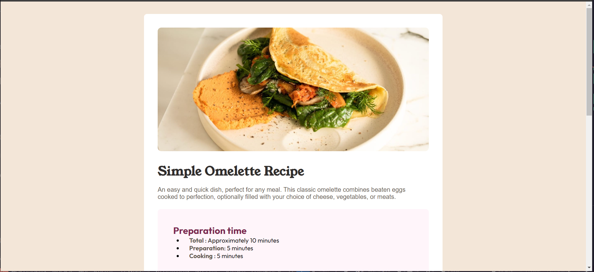
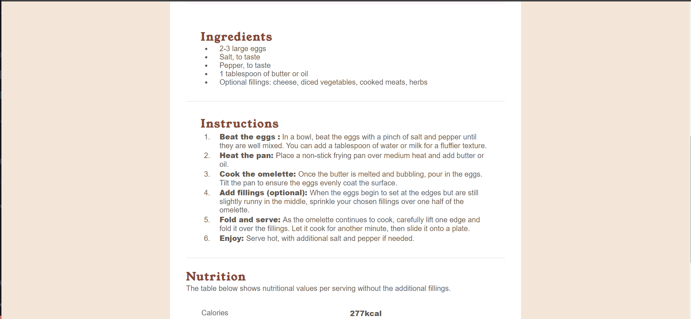

# Frontend Mentor - Recipe page solution

This is a solution to the [Recipe page challenge on Frontend Mentor](https://www.frontendmentor.io/challenges/recipe-page-KiTsR8QQKm). Frontend Mentor challenges help you improve your coding skills by building realistic projects.

## Table of contents

- [Overview](#overview)
  - [The challenge](#the-challenge)
  - [Screenshot](#screenshot)
  - [Links](#links)
- [My process](#my-process)
  - [Built with](#built-with)
  - [Useful resources](#useful-resources)
- [Author](#author)

**Note: Delete this note and update the table of contents based on what sections you keep.**

# Overview

### The challenge
Creating a recipe page. 

### Screenshot

### Links
- Solution URL : [https://github.com/jaysonalfie/Recipe-page.git]
- Live Site URL : [https://recipe-page-five-chi.vercel.app/]

## My process
I was able to refresh my knowledge on using React to create the webpage and also tried to look at the mobile approach first as I was implementing the page. Vanilla css was used for styling of the component.

### Built with

- Semantic HTML5 markup
- CSS custom properties
- [React](https://reactjs.org/) - JS library

## Resources
- [MDN Docs](https://developer.mozilla.org/en-US/)

## Author
- Github - [Jaysonalfie](https://github.com/jaysonalfie)
- Frontend mentor - [Jaysonalfie](https://www.frontendmentor.io/profile/jaysonalfie)
